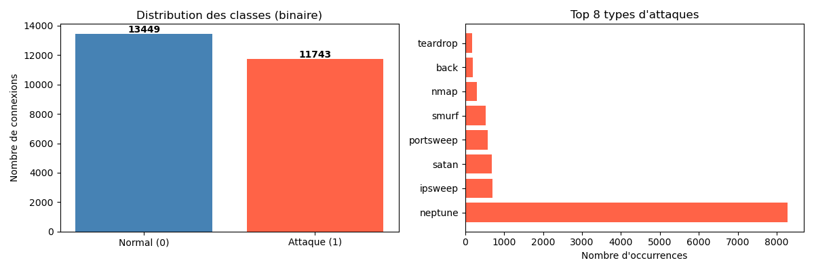
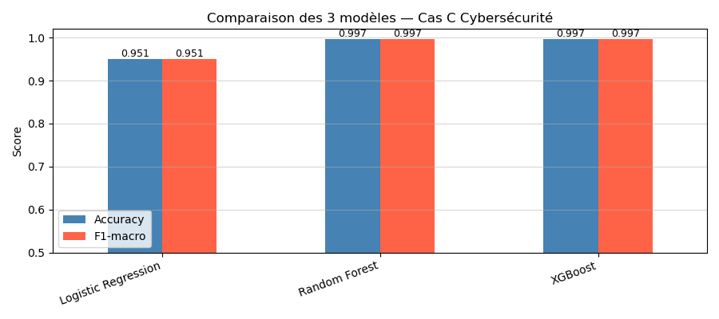
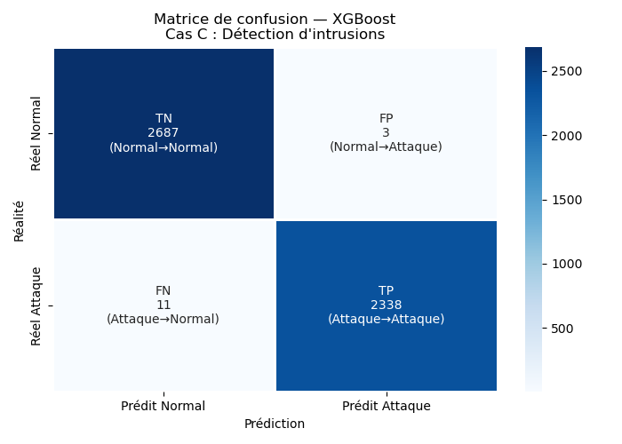
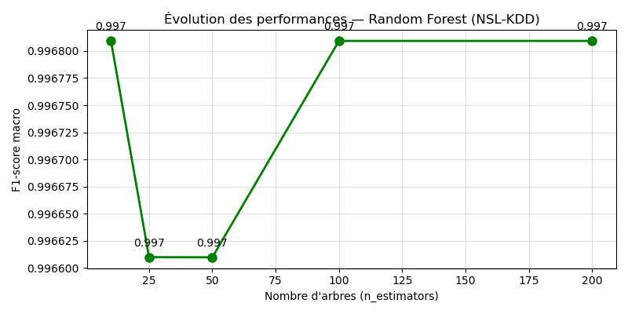
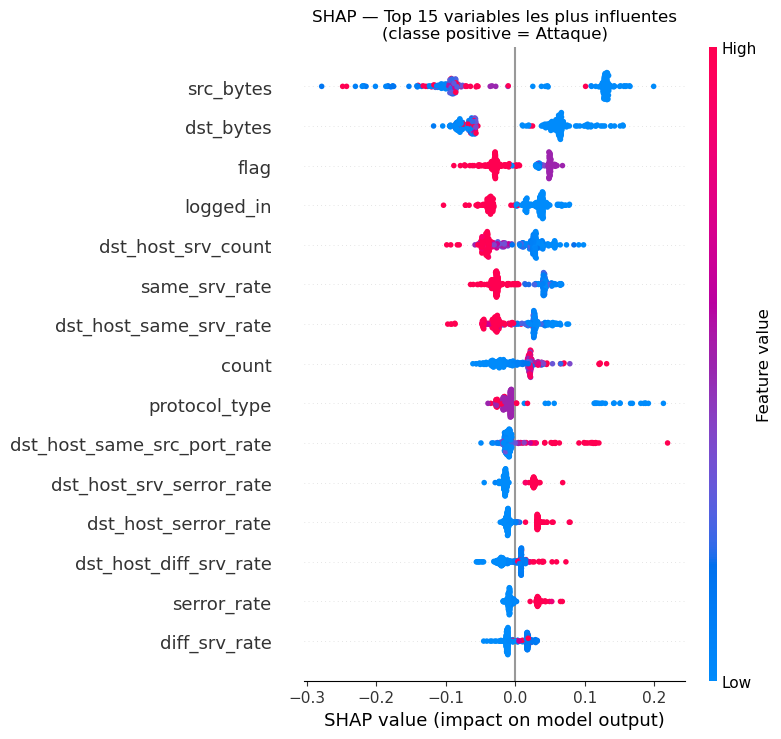
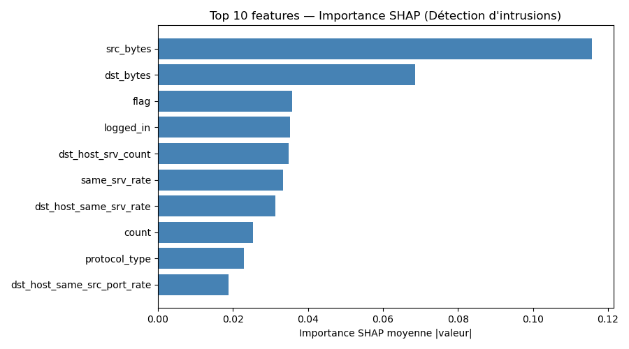

# TP2 — Rapport Cas C : Cybersécurité — Détection d'intrusions réseau

**Matière :** Les fondamentaux de l'IA — Bachelor 3  
**Dataset :** NSL-KDD (sous-ensemble 20%, ~25 192 connexions réseau)  
**Tâche :** Classification binaire — Normal (0) vs Attaque (1)

---

## Étape 1 — Cadrage du projet

### Tableau de cadrage

| DIMENSION | RÉPONSE |
|---|---|
| **Problème métier** | Détecter automatiquement si une connexion réseau est une attaque (intrusion) ou un trafic normal, afin de protéger les infrastructures informatiques |
| **KPI métier** | Taux de détection des attaques (recall attaques), nombre de fausses alarmes par jour, temps de réponse du système de détection |
| **Variable cible (y)** | `label_binary` — 0 = connexion normale, 1 = connexion malveillante (attaque) |
| **Type de tâche ML** | Classification binaire |
| **Métrique ML principale** | **F1-macro** — car le dataset est quasi équilibré mais les deux types d'erreurs ont des coûts asymétriques : un faux négatif (attaque non détectée) est catastrophique, et un faux positif (fausse alarme) coûte cher en temps analyste |
| **Risques identifiés** | Risque de blocage de connexions légitimes (FP), dataset académique de 2009 ne reflétant pas les attaques modernes (biais temporel), potentielle discrimination sur les protocoles utilisés par certains services |
| **Niveau AI Act** | **HAUT RISQUE** — Annexe III : systèmes d'IA utilisés dans la gestion des infrastructures critiques numériques (réseaux, sécurité informatique) |

### Questions guidées

**Q1 — Un faux négatif ou un faux positif est-il plus coûteux ?**  
Le **faux négatif** (une attaque classée comme normale) est de loin le plus coûteux dans le contexte cybersécurité. Une intrusion non détectée peut entraîner : exfiltration de données sensibles, chiffrement ransomware, prise de contrôle de l'infrastructure, pertes financières et réglementaires majeures. Le faux positif (fausse alarme) génère surtout une fatigue des équipes SOC (Security Operations Center) et un ralentissement de service, mais reste gérable.

**Q2 — Quelles populations pourraient être discriminées si le modèle est biaisé ?**  
Ce cas porte sur des connexions réseau et non des individus, donc le risque de discrimination directe sur des personnes est limité. Cependant, un biais systématique pourrait toucher : des pays/régions géographiques dont les patterns réseau ressemblent aux attaques, certains protocoles ou services légitimes sous-représentés dans le dataset d'entraînement. Si des adresses IP sont associées à des données personnelles, le RGPD s'applique (DPIA requis).

---

## Étape 2 — Préparation des données

### Distribution des classes et types d'attaques



Le dataset NSL-KDD (sous-ensemble 20%) contient **25 192 connexions** réparties de façon quasi-équilibrée :

| Classe | Nombre | Proportion |
|---|---|---|
| Normal (0) | 13 449 | **53,4 %** |
| Attaque (1) | 11 743 | **46,6 %** |

L'attaque **neptune** (déni de service SYN Flood) est largement dominante avec ~8 200 occurrences. Les autres attaques représentées sont : ipsweep, satan, portsweep, smurf, nmap, back, teardrop — toutes des attaques classiques de type scan réseau ou DoS.

### Prétraitement appliqué

**Split train/test :** 80 % / 20 % avec stratification → Train : 20 153 exemples | Test : 5 039 exemples  
**Taux d'attaques identiques** dans train et test grâce à la stratification.

| Prétraitement | Justification |
|---|---|
| **Label Encoding** des variables catégorielles (`protocol_type`, `service`, `flag`) | Ces 3 variables nominales doivent être converties en entiers pour les algorithmes ML ; LabelEncoder suffit car les modèles utilisés (RF, XGBoost) gèrent les ordinaux |
| **StandardScaler** (normalisation) | La Régression Logistique est sensible aux échelles ; normaliser harmonise les 41 features numériques (src_bytes peut aller de 0 à millions, duration de 0 à quelques secondes) |
| **Binarisation du label** (`normal` → 0, tout le reste → 1) | Simplifie la tâche en classification binaire pour une prise de décision claire : bloquer ou laisser passer |

### Réponses aux questions de l'Étape 2

**Q1 — Votre dataset est-il équilibré ?**  
Le dataset est **quasi-équilibré** : 53,4 % normal vs 46,6 % attaque. Le déséquilibre est modéré (ratio ≈ 1,15:1). F1-macro reste pertinent mais l'accuracy seule n'est pas trompeuse ici (contrairement à un cas très déséquilibré type 99 % / 1 %).

**Q2 — Y a-t-il des variables potentiellement sensibles ?**  
Les features NSL-KDD sont purement techniques (protocoles réseau, octets échangés, taux d'erreur...) et **ne contiennent aucune donnée personnelle directement identifiable**. En revanche, si des adresses IP source/destination étaient ajoutées (elles ont été anonymisées dans NSL-KDD), elles deviendraient des données personnelles au sens RGPD → exclusion ou pseudonymisation obligatoire.

**Q3 — Quel prétraitement avez-vous appliqué et pourquoi ?**  
Voir tableau ci-dessus. Le pipeline est : Label Encoding → Split stratifié → StandardScaler. Aucune valeur manquante détectée dans NSL-KDD (dataset académique nettoyé). La normalisation est appliquée **uniquement sur X_train** (fit) puis transposée sur X_test (transform) pour éviter toute fuite d'information (data leakage).

---

## Étape 3 — Modélisation : 3 modèles comparés

### Tableau comparatif des performances

| Modèle | Accuracy | F1-macro | F1-weighted |
|---|---|---|---|
| Logistic Regression | 95,1 % | 0,951 | 0,951 |
| Random Forest | **99,7 %** | **0,997** | **0,997** |
| XGBoost | **99,7 %** | **0,997** | **0,997** |

### Graphique comparatif



### Réponses aux questions de l'Étape 3

**Q1 — Quel modèle obtient les meilleures performances ?**  
**Random Forest et XGBoost sont ex-aequo** avec Accuracy = 99,7 % et F1-macro = 0,997. Ils surpassent très largement la Régression Logistique (95,1 %). Le modèle retenu pour l'évaluation approfondie est **XGBoost** (sélectionné automatiquement par la comparaison du F1-macro ; en cas d'égalité parfaite, XGBoost est préféré pour ses capacités de régularisation intégrées).

**Q2 — La Régression Logistique est-elle compétitive malgré sa simplicité ?**  
Avec 95,1 % d'accuracy, la Régression Logistique reste honorable mais **n'est pas compétitive pour ce contexte critique**. Elle produit davantage d'erreurs sur les cas complexes (connexions ambiguës entre trafic normal et attaque). Les relations non-linéaires entre features (ex : combinaison de src_bytes + flag + serror_rate pour identifier une attaque DoS) lui échappent. En cybersécurité, 5 % d'erreurs représentent des centaines d'attaques manquées par jour sur un vrai réseau.

**Q3 — Quel modèle choisir pour un déploiement en production ?**  

**Modèle retenu : XGBoost**

| Critère | Logistic Regression | Random Forest | XGBoost |
|---|---|---|---|
| Performance | ★★★☆☆ | ★★★★★ | ★★★★★ |
| Interprétabilité | ★★★★★ | ★★★☆☆ | ★★★☆☆ |
| Temps d'inférence | ★★★★★ | ★★★☆☆ | ★★★★☆ |
| Coût de maintenance | ★★★★★ | ★★★☆☆ | ★★★★☆ |

**Justification :** XGBoost offre des performances identiques à Random Forest avec un temps d'inférence plus rapide et une empreinte mémoire plus faible — deux critères essentiels pour un IDS (Intrusion Detection System) qui doit analyser des milliers de connexions par seconde. Son F1-macro de 0,997 est indispensable dans un contexte où chaque attaque non détectée peut compromettre l'infrastructure. L'explicabilité est assurée via SHAP (Étape 5).

---

## Étape 4 — Évaluation approfondie

### Matrice de confusion — XGBoost



| | Prédit Normal | Prédit Attaque |
|---|---|---|
| **Réel Normal** | TN = 2 687 ✅ | FP = 3 ⚠️ |
| **Réel Attaque** | FN = **11** 🚨 | TP = 2 338 ✅ |

**Précision attaque :** 2338 / (2338 + 3) = **99,87 %**  
**Rappel attaque :** 2338 / (2338 + 11) = **99,53 %**  
**F1 attaque :** **≈ 0,997**

### Évolution Random Forest selon n_estimateurs



Le F1-macro du Random Forest reste stable à **≈ 0,9968** pour tous les nombres d'arbres testés (10, 25, 50, 100, 200). La courbe montre une légère oscillation mais sans tendance claire — la saturation des performances est atteinte dès **10 arbres** sur ce dataset. Cela indique que le signal discriminant est très fort (les features suffisent à séparer les classes facilement) et qu'augmenter la complexité du modèle n'apporte aucun gain.

### Analyse critique obligatoire

**Q1 — Faux positifs et faux négatifs identifiés :**
- **Faux Positifs (FP = 3) :** 3 connexions normales classées comme attaques → fausses alarmes, l'analyste SOC devrait les investiguer inutilement
- **Faux Négatifs (FN = 11) :** 11 attaques classées comme normales → **intrusions non détectées**, passées à travers le système de défense

**Q2 — Lequel est le plus coûteux dans ce contexte métier ?**  
**Les faux négatifs sont les plus coûteux**, sans aucun doute. Dans le contexte de la détection d'intrusions :
- Un FN = une attaque qui pénètre le réseau sans être bloquée ni alertée. Elle peut exfiltrer des données, installer un malware, préparer une attaque plus grande.
- Un FP = une connexion légitime temporairement bloquée + alerte traitée inutilement par le SOC.

Le coût d'un FP est opérationnel (quelques minutes d'analyse d'un analyste). Le coût d'un FN peut être catastrophique (incident de sécurité majeur, amendes RGPD, atteinte à la réputation).

Avec seulement **11 FN sur 2 349 attaques réelles** (taux de 0,47 %), XGBoost est excellent pour ce cas d'usage. Il faudrait idéalement viser encore plus de recall sur la classe attaque (Recall > 99,9 %) dans un vrai déploiement.

**Q3 — Le modèle est-il suffisant pour un déploiement réel ?**  
**Non, pas en l'état.** Malgré des performances exceptionnelles sur NSL-KDD, plusieurs garanties supplémentaires sont nécessaires :

1. **Réentraînement sur données récentes :** NSL-KDD date de 2009 ; les attaques modernes (ransomwares, APT, attaques cloud-native) n'y figurent pas. Le modèle serait aveugle face à elles.
2. **Détection du drift :** Les patterns réseau évoluent. Il faut surveiller le drift des features en production et réentraîner régulièrement.
3. **Supervision humaine :** Un analyste SOC doit valider les alertes critiques avant tout blocage automatique.
4. **Robustesse adversariale :** Des attaquants sophistiqués peuvent modifier leur trafic pour échapper à la détection ML (adversarial examples).
5. **Testbed sur trafic réel :** Valider le modèle sur des captures réseau réelles avant déploiement.

---

## Étape 5 — Explicabilité SHAP

### SHAP Summary Plot — Top 15 features influentes



### SHAP Bar Chart — Top 10 features



### Réponses aux questions de l'Étape 5

**Q1 — Quelles sont les 3 variables les plus influentes selon SHAP ?**

| Rang | Variable | SHAP moyen |valeur| | Interprétation |
|---|---|---|---|
| 1 | **src_bytes** | ~0,120 | Octets envoyés par la source |
| 2 | **dst_bytes** | ~0,070 | Octets reçus par la destination |
| 3 | **flag** | ~0,035 | État de la connexion TCP (SF, S0, REJ...) |

**Q2 — Ces variables sont-elles cohérentes avec l'intuition métier ?**  
**Oui, totalement cohérentes** avec la connaissance en sécurité réseau :

- **src_bytes / dst_bytes :** Les attaques DoS comme neptune génèrent des patterns de trafic très atypiques (ex : des milliers de paquets SYN avec src_bytes élevé mais dst_bytes quasi nul). Le volume de données échangé est l'un des premiers indicateurs d'une anomalie réseau. C'est exactement ce qu'un analyste SOC regarderait en premier.
- **flag :** L'état TCP (SYN_FLOOD → flag S0, connexion refusée → flag REJ, connexion normale → SF) est directement révélateur. Une attaque SYN flood génère massivement des flags S0 (SYN envoyé, jamais acquitté). Le modèle a correctement appris que le flag est un discriminant fort entre trafic normal et attaque.
- **logged_in :** Une connexion réussie (1) vs une tentative échouée (0) distingue de nombreux types d'attaques de reconnaissance ou de brute-force.
- **dst_host_srv_count / same_srv_rate :** Ces features comportementales (nombre de connexions vers le même service sur l'hôte destination) permettent de détecter les scans de ports (portsweep, nmap) qui contactent de nombreux services différents.

L'analyse SHAP confirme que le modèle utilise des **features réseaux pertinentes** et non des artefacts statistiques du dataset, ce qui renforce la confiance dans sa généralisation.

**Q3 — Si une variable sensible apparaît parmi les plus importantes, que faut-il faire ?**  
Dans notre cas NSL-KDD, aucune variable sensible (âge, genre, origine ethnique) n'est présente. En revanche, si dans un vrai déploiement une variable comme l'**adresse IP source** (pouvant révéler la géolocalisation d'un utilisateur) ou le **pays d'origine** apparaissait parmi les features importantes, il faudrait :
1. **Évaluer si son usage est légal** (base légale RGPD, DPIA)
2. **Tester l'équité** : le modèle traite-t-il différemment des connexions légitimes provenant de certains pays ?
3. Si discriminatoire → **supprimer la variable** et vérifier que les performances restent acceptables
4. Documenter la décision dans le registre de traitement RGPD

---

## Étape 6 — Conformité AI Act

### Tableau de conformité

| CRITÈRE | ANALYSE |
|---|---|
| **Niveau de risque AI Act** | **HAUT RISQUE** (Annexe III, catégorie 1 : infrastructures critiques numériques) |
| **Justification du niveau** | Système de sécurité automatisé décidant de bloquer ou laisser passer des connexions réseau ; déployé sur des infrastructures critiques (réseaux d'entreprise, opérateurs d'importance vitale) ; les décisions automatisées impactent la disponibilité des services et la protection des données |
| **Base légale RGPD** | **Intérêt légitime** (Art. 6.1.f RGPD) — analyse de logs réseau dans un but de sécurité informatique légitime. NSL-KDD ne contient pas d'adresses IP ni de données personnelles directement identifiables. En production réelle avec IPs → nécessite une analyse complémentaire |
| **DPIA requis ?** | **Oui**, si déployé en production sur des logs réseau réels contenant des adresses IP ou des métadonnées identifiables. L'analyse systématique à grande échelle de comportements numériques entre dans le champ de l'Art. 35 RGPD |
| **Explicabilité requise** | **Oui** — SHAP fournit une justification par connexion : "cette connexion a été classée comme attaque principalement parce que src_bytes = X et flag = S0". Indispensable pour qu'un analyste SOC comprenne et valide chaque décision de blocage |
| **Supervision humaine** | **Oui** — Un analyste SOC doit valider les alertes critiques (notamment les blocages définitifs). Le modèle peut agir en mode "pré-filtrage" automatique, mais la décision finale sur les actions à fort impact (isolation d'une machine, coupure de service) reste humaine |
| **Audit et traçabilité** | MLflow pour le versioning des modèles, logs horodatés de chaque décision (connexion ID + prédiction + score de confiance + features SHAP), monitoring du drift en production, rapport mensuel de performance |
| **Droits des personnes** | Droit d'accès et d'information (Art. 13-14 RGPD), droit à ne pas faire l'objet d'une décision entièrement automatisée (Art. 22 RGPD) si des personnes sont directement affectées (ex : compte bloqué), droit de recours auprès du DPO de l'organisation |

### Réponses aux questions de l'Étape 6

**Q1 — Le système nécessite-t-il un audit de conformité avant déploiement ? Par qui ?**  
**Oui, obligatoirement.** En tant que système IA de haut risque (Annexe III AI Act), il doit faire l'objet :
- D'une **évaluation de conformité** avant la mise sur le marché (Art. 43 AI Act)
- D'un **audit technique** par un organisme notifié accrédité pour les systèmes IA critiques
- D'un **test de robustesse** et d'une analyse de sécurité adversariale
- D'une **DPIA** menée par le DPO de l'organisation (Art. 35 RGPD)
- D'une **déclaration de conformité CE** et inscription dans la future base de données EU AI Act

**Q2 — Les personnes affectées ont-elles un droit de recours ?**  
**Oui.** Si une connexion légitime d'un utilisateur est bloquée automatiquement (FP), l'utilisateur affecté doit disposer :
- D'un **droit d'information** sur l'existence du système automatisé (Art. 13 RGPD)
- D'un **droit de recours humain** : contacter le SOC/helpdesk pour faire examiner la décision par un analyste
- D'un **droit à l'explication** : raisons de la classification (fourni par SHAP)
- D'un **droit d'opposition** aux décisions entièrement automatisées aux effets significatifs (Art. 22 RGPD)

**Q3 — Quel organisme de contrôle surveille ce type de système ?**  
- **ANSSI** (Agence Nationale de la Sécurité des Systèmes d'Information) — pour la cybersécurité des opérateurs d'importance vitale (OIV) et des opérateurs de services essentiels (OSE)
- **CNIL** (Commission Nationale de l'Informatique et des Libertés) — si le système traite des données personnelles identifiables (adresses IP, logs utilisateurs)
- **Futur "AI Office" européen** (en cours de mise en place via AI Act) — pour la supervision des systèmes IA à haut risque au niveau européen
- **CERT-FR** — pour la coordination en cas d'incident de sécurité détecté par le système

---

## Slide de synthèse

```
╔══════════════════════════════════════════════════════════════════════════╗
║  CAS : C — Cybersécurité          MODÈLE RETENU : XGBoost               ║
╠══════════════════════════════════════════════════════════════════════════╣
║  MÉTRIQUES FINALES                                                       ║
║  Accuracy : 99,7 %    F1-macro : 0,997    F1-weighted : 0,997            ║
║  Recall attaques : 99,53 %    Précision : 99,87 %    FN : 11 / 2 349     ║
╠══════════════════════════════════════════════════════════════════════════╣
║  TOP 3 VARIABLES (SHAP)                                                  ║
║  1. src_bytes            2. dst_bytes            3. flag (état TCP)      ║
╠══════════════════════════════════════════════════════════════════════════╣
║  AI ACT : Niveau HAUT RISQUE                                             ║
║  Système de sécurité critique — supervision humaine SOC obligatoire      ║
║  DPIA requis — Contrôle : ANSSI + CNIL                                   ║
╠══════════════════════════════════════════════════════════════════════════╣
║  LIMITE PRINCIPALE : Dataset académique NSL-KDD (2009), ne couvre pas   ║
║  les attaques modernes (APT, ransomware, cloud-native) → nécessite       ║
║  réentraînement périodique sur captures réseau récentes                  ║
╚══════════════════════════════════════════════════════════════════════════╝
```

---

## Récapitulatif des graphiques générés

| Fichier | Description | Statut |
|---|---|---|
| `distribution_classes.png` | Distribution Normal/Attaque + Top 8 types d'attaques | ✅ |
| `comparaison_modeles.png` | Accuracy et F1-macro des 3 modèles | ✅ |
| `confusion_matrix.png` | Matrice de confusion XGBoost (TN/FP/FN/TP) | ✅ |
| `rf_evolution.png` | F1-macro Random Forest selon n_estimators | ✅ |
| `shap_summary.png` | SHAP beeswarm — Top 15 features influentes | ✅ |
| `shap_bar.png` | SHAP bar — Importance moyenne Top 10 features | ✅ |

---

*TP2 — Cas C Cybersécurité — NSL-KDD — Classification binaire (détection d'intrusions)*
