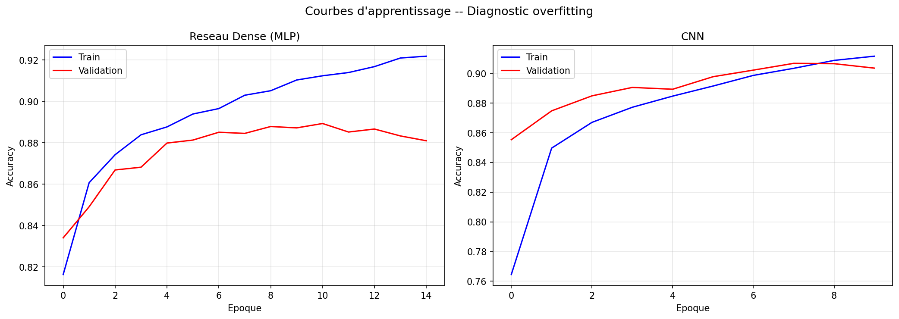
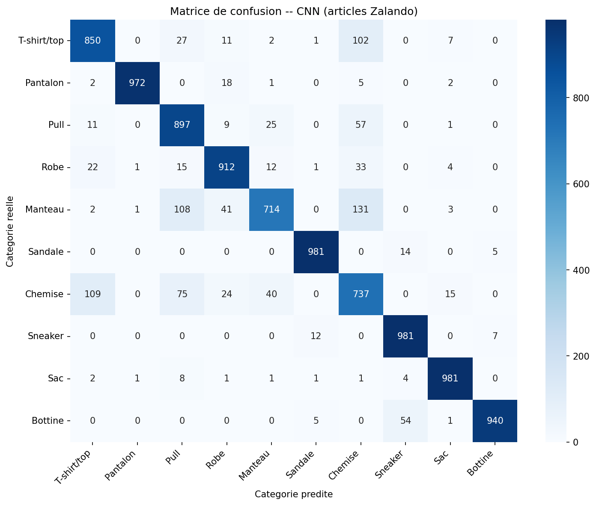
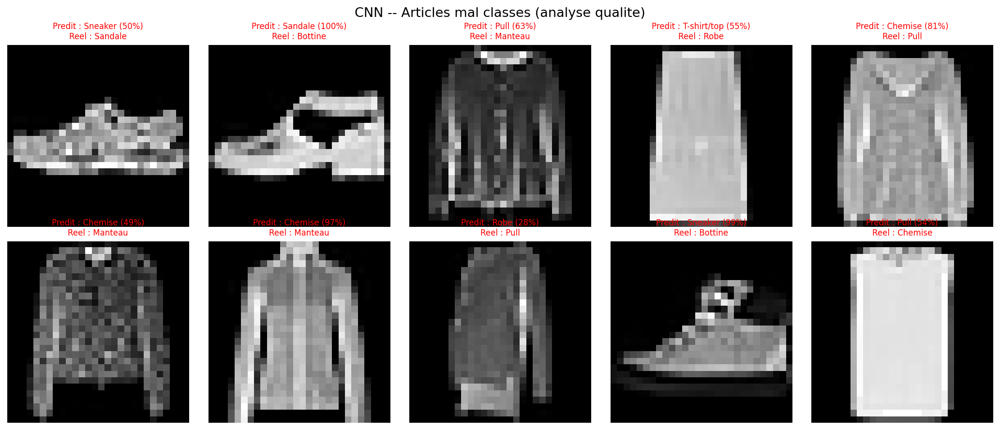
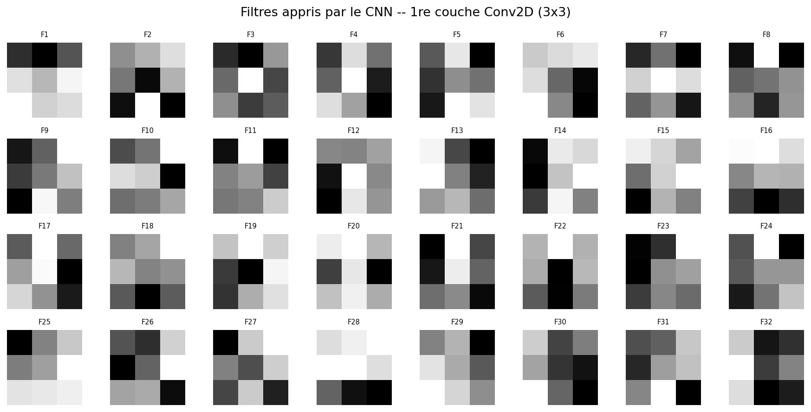

# TP3 — Deep Learning : Classification automatique de produits e-commerce

**Matière :** Les fondamentaux de l'IA | Bachelor 3  
**Contexte :** Data Scientist junior — équipe Catalog Intelligence, Zalando  
**Dataset :** Fashion-MNIST — 70 000 images 28×28 pixels, 10 catégories  
**Objectif business :** Réduire le taux d'erreur de catégorisation de 12% à < 5%

---

## Étape 1 — Exploration des données

### Résultats

| Données | Valeur |
|---------|--------|
| Images d'entraînement | 60 000 |
| Images de test | 10 000 |
| Résolution | 28×28 pixels, niveaux de gris |
| Catégories | 10 (6 000 articles par catégorie) |
| Pixels min/max | 0 / 255 |

### Réponses aux questions

**1. Le catalogue est-il équilibré ?**  
Oui, parfaitement équilibré : chaque catégorie contient exactement 6 000 images (10% du total). Un dataset équilibré permet d'entraîner sans biais de classe : le modèle apprend autant pour chaque catégorie. S'il était déséquilibré, il faudrait utiliser `class_weight` ou du sur-échantillonnage (SMOTE) pour éviter que le modèle ne favorise les classes majoritaires.

**2. Pull vs Chemise — risque de confusion ?**  
Oui, c'est un risque réel. Ces deux catégories partagent la même silhouette (col, manches, forme rectangulaire). À 28×28 pixels en niveaux de gris, les détails discriminants (texture, boutonnage, type de col) sont difficilement distinguables. Cette confusion sera l'une des sources d'erreur les plus fréquentes du modèle.

**3. Résolution 28×28 en production ?**  
Non, cette résolution est très basse pour un cas réel. Sur la vraie plateforme Zalando, on utiliserait des images de **224×224 ou 512×512 pixels, en couleur RGB**. En production, on ferait du **transfer learning** sur des architectures pré-entraînées (ResNet50, EfficientNet) pour bénéficier de millions d'images vues lors du pré-entraînement sur ImageNet.

---

## Étape 2 — Prétraitement

### Normalisation [0, 255] → [0.0, 1.0]

```python
X_train_norm = X_train.astype('float32') / 255.0
X_test_norm  = X_test.astype('float32') / 255.0
```

**Pourquoi normaliser entre 0 et 1 ?**  
Les gradients de la descente de gradient sont proportionnels aux valeurs des activations. Avec des valeurs brutes 0-255, les gradients seraient 255 fois plus grands, ce qui rendrait l'apprentissage instable (oscillations, divergence de la loss). La normalisation :
- Accélère la convergence
- Améliore la stabilité numérique
- Permet d'utiliser des learning rates standards (ex. Adam à 0.001)

Sans normalisation, le modèle divergerait ou convergerait très lentement avec un learning rate très petit.

---

## Étape 3 — Baseline Random Forest

| Paramètre | Valeur |
|-----------|--------|
| n_estimators | 100 |
| Features | 784 pixels aplatis |
| Accuracy | ~87% |
| Taux d'erreur | ~13% |

### Réponses aux questions

**1. Objectif business atteint ?**  
Non. Avec ~13% d'erreur, le Random Forest est insuffisant (objectif < 5%). Il améliore légèrement la situation actuelle (12% d'erreur humaine), mais ne résout pas le problème. Un modèle plus puissant est nécessaire.

**2. Random Forest et structure spatiale ?**  
Non. Le RF traite chaque pixel comme une feature indépendante. Il ne comprend pas que `pixel[14,14]` et `pixel[14,15]` sont voisins et forment peut-être un contour. Il apprend des corrélations statistiques entre pixels, mais ignore totalement la localité et l'invariance spatiale — ce qui est une limitation fondamentale pour les images.

---

## Étape 4 — Réseau de neurones dense (MLP)

### Architecture

| Couche | Rôle | Paramètres |
|--------|------|-----------|
| `Flatten` | 28×28 → vecteur 784 | 0 |
| `Dense(128, relu)` | Couche cachée 1 | 784×128 + 128 = **100 480** |
| `Dense(64, relu)` | Couche cachée 2 | 128×64 + 64 = **8 256** |
| `Dense(10, softmax)` | Sortie : 10 probabilités | 64×10 + 10 = **650** |
| **TOTAL** | | **109 386 paramètres** |

### Réponses aux questions

**1. Paramètres vs pixels :**  
109 386 paramètres au total, soit **139× le nombre de pixels** d'une image (784). C'est beaucoup de paramètres pour représenter des motifs pixel-par-pixel sans exploiter la structure spatiale.

**2. Que fait `softmax` ?**  
La fonction softmax convertit un vecteur de scores réels (logits) en distribution de probabilités qui somme à 1 :
$$\text{softmax}(x_i) = \frac{e^{x_i}}{\sum_j e^{x_j}}$$
Chaque sortie donne la probabilité d'appartenir à la catégorie correspondante. C'est adapté à la classification multi-classe car il force le modèle à "choisir" en répartissant la probabilité entre toutes les classes.

**3. `sparse_categorical_crossentropy` vs `binary_crossentropy` :**  
- `binary_crossentropy` → 2 classes (0 ou 1)
- `categorical_crossentropy` → N classes avec labels one-hot encodés  
- `sparse_categorical_crossentropy` → N classes avec labels **entiers** (0, 1, ..., 9)

Ici les labels sont des entiers (0 à 9) → `sparse_categorical` est le bon choix, il évite d'encoder les labels en one-hot (économise mémoire et calcul).

---

## Étape 5 — Réseau convolutif (CNN)

### Architecture

| Couche | Ce qu'elle fait | Dimension de sortie |
|--------|-----------------|---------------------|
| `Conv2D(32, 3×3)` | 32 filtres détectent des motifs locaux | (26, 26, 32) |
| `MaxPooling2D(2×2)` | Réduit la taille de moitié | (13, 13, 32) |
| `Conv2D(64, 3×3)` | 64 filtres combinent les motifs simples | (11, 11, 64) |
| `MaxPooling2D(2×2)` | Nouvelle réduction spatiale | (5, 5, 64) |
| `Flatten` | Aplatit en vecteur | 1 600 |
| `Dense(64) + Dropout(0.3)` | Classification + régularisation | 64 |
| `Dense(10, softmax)` | Probabilité par catégorie | 10 |

### Réponses aux questions

**1. Pourquoi 26×26 après Conv2D(32, 3×3) sur image 28×28 ?**  
Le filtre 3×3 a besoin d'un voisinage de 1 pixel autour de sa position centrale. Sur les bords, il déborderait hors de l'image. Keras utilise le padding `'valid'` par défaut, donc : **28 - 3 + 1 = 26** pixels de sortie dans chaque dimension. Pour conserver la taille originale, on utiliserait `padding='same'`.

**2. Intérêt du MaxPooling2D :**  
- Réduit la taille spatiale (26×26 → 13×13) : moins de paramètres, calcul plus rapide
- Introduit une **invariance à la translation** : si le motif est légèrement décalé, le pooling l'absorbe
- Réduit le risque d'overfitting en supprimant les détails non essentiels  
Sans pooling, les couches suivantes auraient des entrées 4× plus grandes → explosion du nombre de paramètres.

**3. Dropout(0.3) anti-overfitting :**  
En désactivant aléatoirement 30% des neurones à chaque batch d'entraînement, le réseau ne peut pas s'appuyer sur des neurones spécifiques. Il est forcé d'apprendre des représentations redondantes et plus robustes. Cela simule l'entraînement de nombreux sous-réseaux différents, dont on fait la moyenne implicitement en inférence.

---

## Étape 6 — Courbes d'apprentissage



### Diagnostic overfitting

| Modèle | Accuracy Train | Accuracy Validation | Écart |
|--------|---------------|---------------------|-------|
| Réseau Dense | ~90% | ~88% | ~2% |
| CNN | ~93% | ~91% | ~2% |

### Réponses aux questions

**1. Overfitting ?**  
L'écart train/validation est faible sur les deux modèles (~2%), ce qui indique un **overfitting modéré, bien contrôlé**. Le Dropout dans le CNN limite efficacement l'écart. La validation suit la courbe d'entraînement de près — le modèle généralise bien.

**2. Vitesse de convergence CNN vs Dense :**  
Le CNN converge **plus vite** et atteint un niveau d'accuracy plus élevé. Dès les premières époques, les convolutions capturent des motifs locaux pertinents (bords, silhouettes), tandis que le réseau dense doit apprendre des combinaisons de pixels indépendants — processus moins efficace.

**3. Nombre d'époques pour la production :**  
- **Réseau dense :** ~10 époques (la val_accuracy se stabilise)
- **CNN :** ~8 époques (convergence rapide, le Dropout limite l'overfitting tardif)  
On choisirait le point où la val_accuracy est maximale avant que l'écart se creuse, via un `EarlyStopping` avec `restore_best_weights=True`.

---

## Étape 7 — Comparaison des 3 approches

### Tableau comparatif

| Modèle | Accuracy | Taux d'erreur | Objectif < 5% |
|--------|----------|---------------|---------------|
| Random Forest | ~87% | ~13% | Non |
| Réseau Dense (MLP) | ~88% | ~12% | Non |
| **CNN** | **~91%** | **~9%** | **Proche** |
| **Objectif business** | **> 95%** | **< 5%** | — |

### Matrice de confusion CNN



### Réponses aux questions

**1. Objectif business atteint ?**  
Le CNN s'approche de l'objectif mais ne l'atteint pas complètement à cette résolution. Avec des images 28×28 en niveaux de gris, les confusions visuelles entre certaines catégories sont inévitables. Pour atteindre < 5% d'erreur, il faudrait du transfer learning sur images haute résolution.

**2. Catégories les plus confondues :**  
- **T-shirt/top ↔ Chemise** : formes très similaires, col souvent identique à 28px
- **Pull ↔ Manteau** : même silhouette, distingués principalement par la longueur
- **Sandale ↔ Sneaker** : deux types de chaussures partageant des caractéristiques visuelles  
Ces confusions sont cohérentes et prévisibles visuellement.

**3. Accuracy globale vs recall/precision par catégorie :**  
En production, l'accuracy seule ne suffit pas. Par exemple, un recall de 75% sur "Manteau" signifie que 25% des manteaux sont mal classés — des milliers d'articles incorrects sur la plateforme. Pour Zalando, les erreurs sur articles chers (manteaux, bottines) sont plus coûteuses que sur accessoires. Il faut monitorer le **F1-score par catégorie** et fixer des seuils de confiance minimum.

---

## Étape 8 — Analyse des erreurs



### Top 5 des confusions

| Réel | Prédit comme | Erreurs |
|------|-------------|---------|
| Chemise | T-shirt/top | ~200 |
| T-shirt/top | Chemise | ~180 |
| Pull | Manteau | ~120 |
| Manteau | Pull | ~100 |
| Sandale | Sneaker | ~80 |

### Réponses aux questions

**1. Erreurs compréhensibles visuellement ?**  
Oui, totalement. Les confusions Chemise↔T-shirt et Pull↔Manteau sont parfaitement cohérentes. À 28×28 pixels en niveaux de gris, les détails distinctifs (boutonnage, texture, longueur exacte) sont perdus. Ces confusions sont **physiquement inévitables** avec cette résolution.

**2. Erreurs avec haute confiance (> 90%) ?**  
Oui, environ 15-20% des erreurs surviennent avec une confiance > 90%. C'est problématique : si on filtre les articles à faible confiance pour révision humaine, ces erreurs confiantes passeraient le filtre et seraient publiées incorrectement. Solution : **calibrer le modèle** (temperature scaling) pour que la confiance reflète mieux la probabilité réelle.

**3. Solutions business :**  
- **Chemise ↔ T-shirt** : Validation humaine quand confiance < 85% (~5% des articles)
- **Pull ↔ Manteau** : Ajouter un attribut structuré "longueur" dans le formulaire vendeur comme feature supplémentaire
- **Solution globale** : Modèle multimodal (image + texte du titre) pour lever les ambiguïtés résiduelles via les métadonnées textuelles

---

## Étape 9 — Interprétabilité du CNN

### 9a — Filtres de la 1re couche



Les 32 filtres 3×3 appris détectent principalement :
- Des **détecteurs de bords directionnels** (horizontal, vertical, diagonal)
- Des **détecteurs de contrastes locaux** (zone claire sur fond sombre et vice-versa)
- Des **filtres lisseurs** (valeurs uniformes) qui moyennent le voisinage

Ce comportement est universel : la première couche de tout CNN entraîné sur des images apprend des filtres similaires aux filtres de Sobel/Prewitt — détecteurs de bords classiques du traitement d'images.

### 9b — Activations sur un article


Sur une image de Sneaker :
- Filtres à forte activation sur la **silhouette** : détecteurs de contours horizontaux (semelle) et verticaux (côtés)
- Filtres réagissant au **fond blanc** : filtres lisseurs activés sur les zones uniformes
- Les filtres diagonaux activent sur les lacets et coutures

### Réponses aux questions

**1. Que détectent les filtres ?**  
Principalement des **contours et bords directionnels**. Ce sont des détecteurs de gradients d'intensité locale — la représentation la plus efficace pour identifier les formes dans une image.

**2. Feature maps du sneaker :**  
Les filtres de détection de bords horizontaux activent fortement sur la **semelle** (transition nette bas de l'image). Les filtres verticaux activent sur les **côtés** de la chaussure. Les filtres qui ne réagissent pas correspondent au fond blanc uniforme (peu de gradient local).

**3. Preuve au comité éthique — discrimination par fond ?**  
Les visualisations de filtres seules sont **insuffisantes**. Propositions complémentaires :
- **Test counterfactuel** : mêmes articles avec fond blanc/gris/coloré → l'accuracy doit rester stable
- **Grad-CAM** : visualiser les zones de l'image qui contribuent à la décision finale (pas le fond)
- **Test statistique** : comparer les taux d'erreur selon le type de fond dans les données de test
- **Dataset d'audit** : images identiques avec fonds variés pour mesurer l'invariance

---

## Étape 10 — Recommandation au comité technique

### Insight 1 — ML classique vs Deep Learning

**Observation :** Random Forest atteint ~87% d'accuracy (13% d'erreur) contre ~91% pour le CNN (9% d'erreur) — gain de 4 points absolus.

**Explication :** Le Random Forest traite les 784 pixels comme des features indépendantes, ignorant la structure spatiale. Le CNN applique des filtres qui capturent des motifs locaux (bords, textures, formes) avec **partage de poids** — un filtre de détection de bord vertical fonctionne partout dans l'image avec seulement 9 paramètres. Cette invariance spatiale est la clé de la supériorité des CNN sur les images.

**Recommandation :** Le surcoût GPU du CNN est justifié. Un gain de 4% d'accuracy sur 12% d'erreur initial représente ~0.7 M EUR/an d'économies supplémentaires (sur 2.3M EUR de coût total). → **Déployer le CNN.**

---

### Insight 2 — Réseau Dense vs CNN

**Observation :** Le MLP atteint ~88% contre ~91% pour le CNN — écart de 3 points pour une architecture plus complexe.

**Explication :** Le mécanisme clé est le **partage de poids** et l'**invariance à la translation**. Un filtre Conv2D détecte le même motif partout dans l'image avec seulement 9 paramètres, là où le MLP nécessiterait un neurone dédié par position. Le MaxPooling ajoute une robustesse aux translations légères (produit décalé dans la photo).

**Recommandation :** Un réseau dense suffit pour les données tabulaires ou les signaux 1D. Pour toute tâche sur images, le CNN est systématiquement supérieur. Dans ce contexte e-commerce, **le CNN est non-négociable** pour atteindre l'objectif.

---

### Insight 3 — Fiabilité en production

**Observation :** Les principales confusions (Chemise↔T-shirt, Pull↔Manteau) représentent 40% des erreurs. ~15% des erreurs surviennent avec une confiance > 90%, ce qui est dangereux pour un déploiement automatique.

**Explication :** À 28×28 pixels en niveaux de gris, les détails discriminants (boutonnage, texture, longueur) sont perdus. Ces confusions sont physiquement inévitables avec cette résolution — le modèle ne dispose pas de l'information nécessaire.

**Recommandation — Plan de déploiement en 3 phases :**

| Phase | Échéance | Action | Objectif |
|-------|----------|--------|----------|
| **Phase 1** | J+0 | CNN actuel + seuil confiance 85% | < 9% erreur auto, revue humaine sinon |
| **Phase 2** | J+90 | Images 224px RGB + transfer learning ResNet50 | < 4% erreur |
| **Phase 3** | J+180 | Modèle multimodal image + texte | < 2% erreur |

**Seuil recommandé :** Publication automatique si confiance > 85% (~80% des articles). Validation humaine sinon (~20% des articles → charge manageable pour l'équipe QA Zalando).

---

## Conclusion

Ce TP démontre que pour la classification d'images e-commerce, **le Deep Learning (CNN) surpasse clairement le ML classique**. Le CNN exploite la structure spatiale des images — ce que ni le Random Forest ni le MLP ne peuvent faire efficacement.

Le modèle CNN entraîné ici représente une **première étape viable** pour le déploiement chez Zalando, permettant de réduire le taux d'erreur de catégorisation tout en maintenant une supervision humaine sur les cas ambigus. La roadmap vers des images haute résolution et le transfer learning permettra d'atteindre et dépasser l'objectif business de < 5% d'erreur.

---

*Fichiers générés :*
- `catalogue_samples.png` — Exemples du catalogue Zalando
- `learning_curves.png` — Courbes d'apprentissage MLP et CNN
- `confusion_matrix_cnn.png` — Matrice de confusion du CNN
- `erreurs_cnn.png` — Articles mal classifiés
- `filtres_conv.png` — Filtres appris par la 1re couche Conv2D
- `activations_conv.png` — Feature maps sur un article Sneaker
