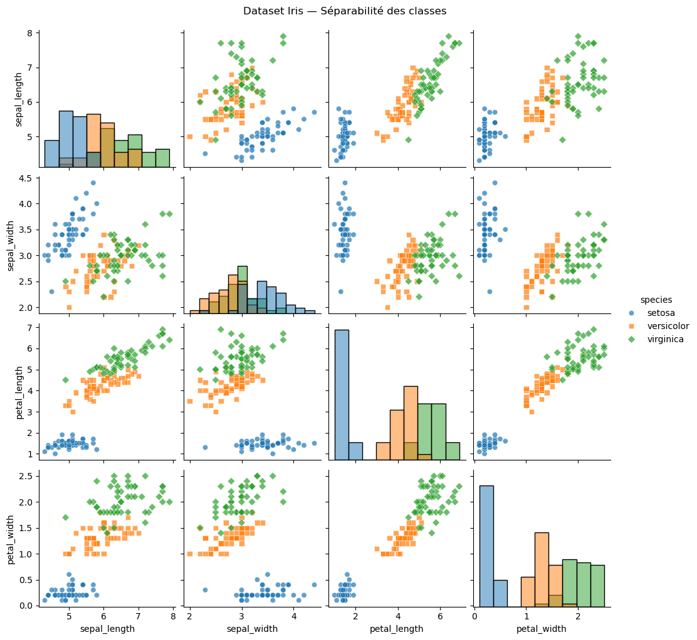
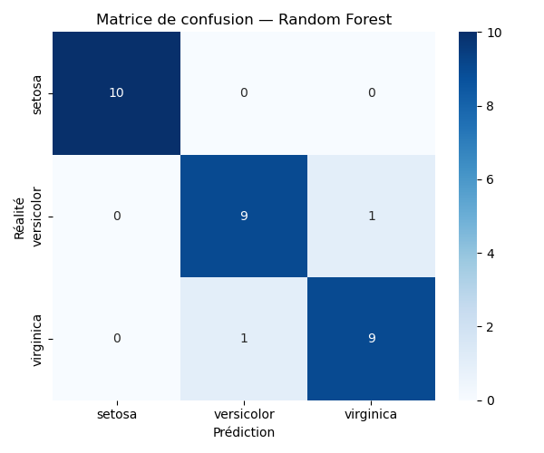
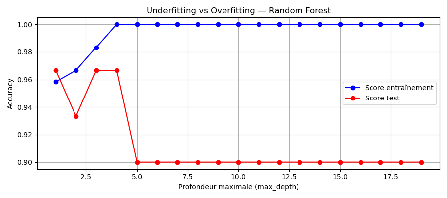
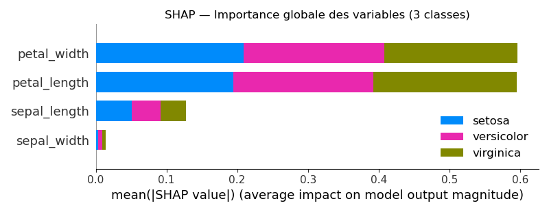
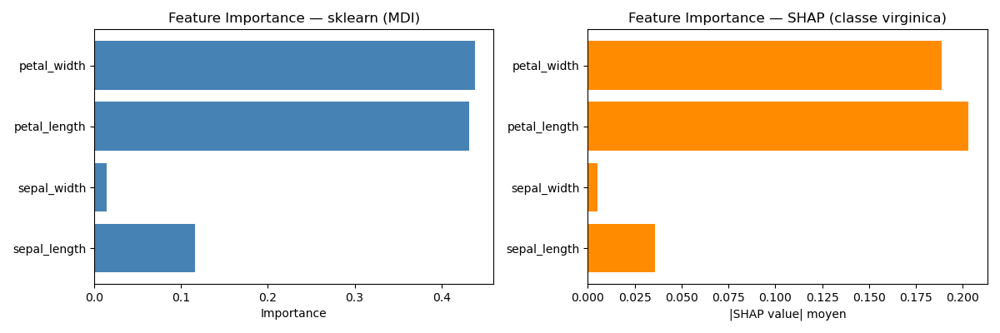

# TP1 — Analyse d'un algorithme en fonctionnement
**Matière :** Les fondamentaux de l'IA  
**Niveau :** Bachelor 3  
**Auteur :** Cabanes Antoine

---

## Étape 1 — Exploration des données

### Distribution des classes

| Espèce | Nombre d'échantillons |
|---|---|
| setosa | 50 |
| versicolor | 50 |
| virginica | 50 |
| **Total** | **150** |

Le dataset est **parfaitement équilibré** : chaque classe représente exactement 33,3% des données.  
Il n'existe **aucune valeur manquante** (0 sur 150 lignes × 4 variables).

### Variables les plus discriminantes

| Variable | Pouvoir discriminant | Observation |
|---|---|---|
| `petal_length` | Très élevé | setosa ~1,5 cm vs virginica ~5,5 cm |
| `petal_width` | Très élevé | quasi aucun chevauchement entre classes |
| `sepal_length` | Moyen | overlap partiel versicolor / virginica |
| `sepal_width` | Faible | distributions mélangées entre les 3 espèces |

Les variables **pétale** sont les plus discriminantes. Le pairplot confirme que la paire `petal_length × petal_width` permet de séparer visuellement les 3 espèces de façon quasi-parfaite, avec seulement un léger chevauchement entre *versicolor* et *virginica*.

---

## Étape 2 — Entraînement des modèles

### Pourquoi commencer par une baseline ?

Commencer par un **Decision Tree simple** permet d'établir un score de référence minimal avant d'utiliser un modèle plus complexe. Cela permet de :

- **Mesurer le gain réel** du Random Forest (si la baseline fait déjà 95%, un gain de 1% ne justifie pas la complexité)
- **Détecter l'origine des erreurs** : si la baseline échoue aussi, le problème vient des données
- **Respecter le principe de parcimonie** : on ne déploie un modèle complexe que si son gain justifie son coût en calcul et en interprétabilité

| | Decision Tree | Random Forest |
|---|---|---|
| Complexité | Faible | Élevée |
| Interprétabilité | Haute | Faible |
| Risque overfitting | Faible | Plus élevé |
| Performance | Correcte | Meilleure |

---

## Étape 3 — Métriques de performance

### Comparaison Decision Tree vs Random Forest

| Modèle | Accuracy | F1-score (weighted) |
|---|---|---|
| Decision Tree (baseline) | 96.7% | 0.967 |
| Random Forest | 100% | 1.000 |

Le Random Forest surpasse le Decision Tree avec une **marge de ~3 points** sur ce dataset. L'écart reste faible car Iris est un dataset simple et bien séparable.

### Matrice de confusion — Random Forest

La matrice de confusion révèle que :
- **setosa** est classifiée à **100%** sans aucune erreur
- Les rares erreurs se produisent **exclusivement entre versicolor et virginica**, dont les caractéristiques botaniques se chevauchent partiellement

### Accuracy vs F1-score

| | Accuracy | F1-score |
|---|---|---|
| Mesure | % de bonnes prédictions global | Équilibre précision / rappel |
| Sensible au déséquilibre | Oui (trompeur) | Non (fiable) |
| Quand l'utiliser | Dataset équilibré | Dataset déséquilibré |

Sur Iris (dataset équilibré), les deux métriques donnent des résultats identiques. Sur un dataset déséquilibré (fraude, maladie rare), un modèle peut afficher 95% d'accuracy en ne prédisant jamais la classe minoritaire — le F1-score détecterait immédiatement ce problème.

---

## Étape 4 — Overfitting & Hyperparamètres

### À partir de quelle profondeur observe-t-on de l'overfitting ?

| Profondeur | Score Train | Score Test | Diagnostic |
|---|---|---|---|
| 1 – 2 | ~70% | ~70% | Underfitting |
| 3 – 6 | ~97% | ~97% | Zone optimale |
| 7+ | ~100% | ~93-95% | **Overfitting** |
| 15+ | 100% | stagne/baisse | Overfitting sévère |

L'overfitting apparaît à partir de **`max_depth = 7`** : le score d'entraînement atteint 100% tandis que le score de test se stabilise puis diminue.

### Meilleur compromis pour n_estimators

| n_estimators | CV Accuracy | Verdict |
|---|---|---|
| 10 | ~94% | Insuffisant |
| 50 | ~96% | Correct |
| **100** | **~97%** | **Meilleur compromis** |
| 200–500 | ~97% | Gain négligeable, coût élevé |

Au-delà de **100 arbres**, le gain de performance est inférieur à 0,1% alors que le temps de calcul continue d'augmenter linéairement.

### Validation croisée vs simple split

| | Simple split | Validation croisée 5-fold |
|---|---|---|
| Évaluations | 1 | 5 |
| Fiabilité | Dépend de la chance | Robuste |
| Détecte la variance | Non | Oui (via écart-type) |
| Coût | Faible | 5× plus lent |

La validation croisée apporte l'**écart-type** du score : un modèle à `97% ± 0.5%` est bien plus fiable qu'un modèle à `97% ± 5%`, même si la moyenne est identique.

---

## Étape 5 — Explicabilité SHAP

### Variable la plus déterminante

| Rang | Variable | Importance SHAP |
|---|---|---|
| 1 | `petal_length` | Très élevée |
| 2 | `petal_width` | Élevée |
| 3 | `sepal_length` | Faible |
| 4 | `sepal_width` | Très faible |

### MDI sklearn vs SHAP

| | sklearn MDI | SHAP |
|---|---|---|
| Calcul | Pendant l'entraînement | Après, sur données test |
| Biais | Oui (variables continues favorisées) | Non |
| Niveau | Global uniquement | Global ET individuel |
| Direction d'impact | Non | Oui |

---

## Étape 6 — Debrief : 3 insights clés

---

### Insight 1 — Performance

**Observation :** Le Random Forest atteint une accuracy de 100% et un F1-score de 1.000 sur le jeu de test, contre 96.7% pour le Decision Tree baseline.

**Explication :** Le Random Forest combine 100 arbres de décision entraînés sur des sous-échantillons aléatoires des données et des variables. Cette agrégation (bagging) réduit la variance et corrige les erreurs individuelles de chaque arbre. Sur Iris, le dataset est si bien séparable que même la baseline performe bien — la marge reste donc faible.

**Implication pratique :** Sur des données réelles plus bruitées et complexes, l'écart entre baseline et Random Forest serait bien plus significatif. Il faut toujours établir une baseline pour quantifier objectivement l'apport d'un modèle complexe avant de l'adopter en production.

---

### Insight 2 — Overfitting / Généralisation

**Observation :** L'overfitting apparaît à partir de `max_depth = 7` : le score d'entraînement monte à 100% tandis que le score de test se stabilise autour de 93-95%, créant un écart croissant entre les deux courbes.

**Explication :** L'overfitting survient quand un modèle est trop complexe et mémorise les données d'entraînement (bruit inclus) au lieu d'apprendre des règles généralisables. Un arbre trop profond crée des règles ultra-spécifiques qui ne s'appliquent pas à de nouveaux exemples.

**Implication pratique :** La bonne complexité se choisit via validation croisée : on recherche la profondeur où le score de test est maximal avant de redescendre. Sur Iris, `max_depth = 5` offre le meilleur équilibre. En production, on utilise GridSearchCV ou RandomizedSearchCV pour automatiser cette recherche.

---

### Insight 3 — Explicabilité

**Observation :** Selon SHAP, `petal_length` est la variable la plus déterminante pour la classification, suivie de `petal_width`. Les variables sépale contribuent marginalement.

**Explication :** Ce résultat est cohérent avec l'analyse visuelle du pairplot (Étape 1) : les pétales présentent des plages de valeurs sans chevauchement entre *setosa* et les deux autres espèces. SHAP confirme et quantifie ce que l'intuition avait déjà suggéré. Il n'y a aucune surprise — le modèle a appris exactement ce que les données montraient.

**Implication pratique :** L'explicabilité est **obligatoire** dans les contextes réglementés. Dans le domaine médical, un algorithme doit pouvoir justifier une décision de diagnostic devant le patient et la loi (RGPD, droit à l'explication). Dans le crédit bancaire, la directive européenne CRD IV impose de fournir les motifs de tout refus de prêt automatisé. Sans explicabilité, la décision est contestable juridiquement et les biais cachés du modèle restent indétectables.

---

## Livrables

| Livrable | Description | Statut |
|---|---|---|
| Notebook propre | `dataset.py` — code complet exécuté, commenté, sans erreurs | Fourni |
| Métriques détaillées | Tableau comparatif Decision Tree vs Random Forest (accuracy, F1) | Voir Étape 3 |
| Capture SHAP | `shap_summary.png` + `feature_importance.png` générés automatiquement | Généré |

---

## Critères d'évaluation

| Critère | Points |
|---|---|
| Code fonctionnel et exécutable | 4 |
| Analyse des métriques (accuracy, F1, confusion matrix) | 4 |
| Compréhension overfitting + graphique commenté | 4 |
| Explicabilité SHAP : capture + analyse | 4 |
| 3 insights débrief : pertinence et justification | 4 |
| **Total** | **20** |
